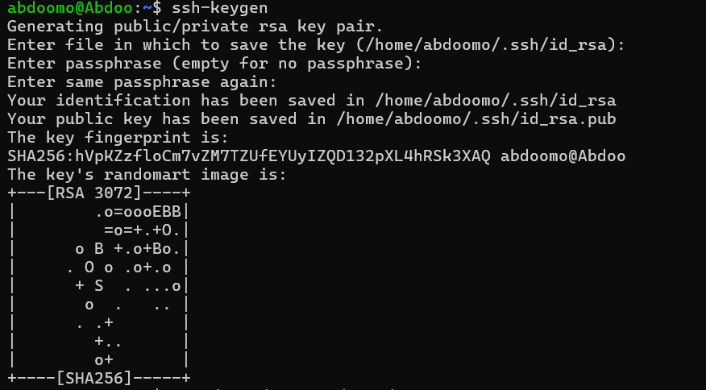
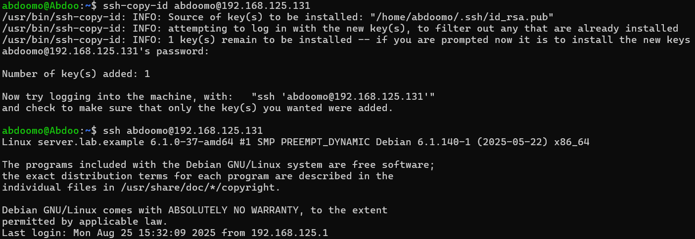
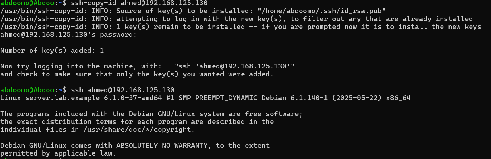
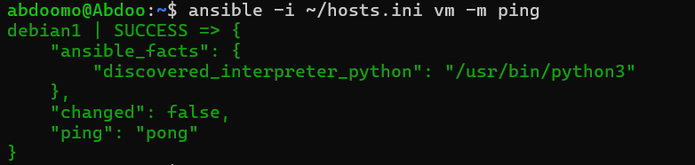

# ansible-1


# **Ansible and SSH Automation**

This document explains the process of configuring passwordless SSH access for multiple virtual machines (VMs) and verifying connectivity using Ansible.

---

## **1. Initial SSH Access (with Password)**

Before configuring passwordless SSH, you first connect manually to each VM using SSH.  
At this stage, the server still requires you to enter the **user password**.

### **For VM1**
```bash
ssh abdoomo@192.168.125.131
```
👉 At this point, the system prompts for `abdoomo`'s password.

### **For VM2**
```bash
ssh ahmed@192.168.125.130
```
👉 Here, the system prompts for `ahmed`'s password.

*(This shows the initial login method before enabling key-based authentication.)*

---

## **2. Generating SSH Keys**

The first step for passwordless authentication is generating an RSA key pair using the `ssh-keygen` command.

```bash
ssh-keygen
```



This creates a **private key** (`id_rsa`) and a **public key** (`id_rsa.pub`) inside the `.ssh` directory.

---

## **3. Copying Public Keys to Each VM**

To enable passwordless SSH, copy the public key to each VM using the `ssh-copy-id` command.  
After this step, you can log in without entering a password.

### **For VM1 (`192.168.125.131`, user: `abdoomo`)**
```bash
ssh-copy-id abdoomo@192.168.125.131
ssh abdoomo@192.168.125.131
```
 
### **For VM2 (`192.168.125.130`, user: `ahmed`)**
```bash
ssh-copy-id ahmed@192.168.125.130
ssh ahmed@192.168.125.130
```
 

✅ Now passwordless SSH access is configured on **all VMs**.

---

## **4. Defining Ansible Inventory**

The `hosts.ini` file defines the inventory of managed nodes.  
It organizes the machines under a group called `[vm]`, specifying their IPs and SSH users.

```bash
cat hosts.ini
```

Example:
```ini
[vm]
debian1 ansible_host=192.168.125.131 ansible_user=abdoomo
debian-cloned ansible_host=192.168.125.130 ansible_user=ahmed
```

 

---

## **5. Testing Connectivity with Ansible**

The `ansible -i ~/hosts.ini vm -m ping` command tests the connectivity between the Ansible controller and the VMs.  

```bash
ansible -i ~/hosts.ini vm -m ping
```

- `-i ~/hosts.ini` → points to the inventory file.  
- `vm` → group of hosts to target.  
- `-m ping` → runs the **ping module** (used to test basic connectivity).  

Expected successful output:
```json
debian1 | SUCCESS => { "ping": "pong" }
debian-cloned | SUCCESS => { "ping": "pong" }
```

 


- Configured Ansible inventory with host IPs and users.  
- Verified connectivity using Ansible `ping` module on all VMs.  
